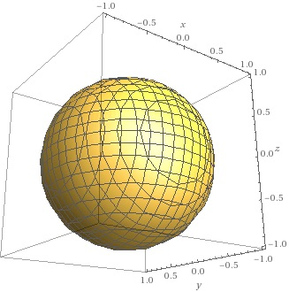
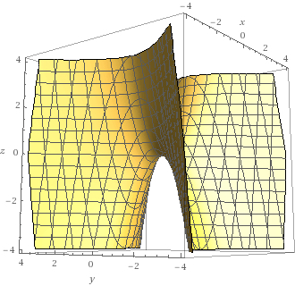
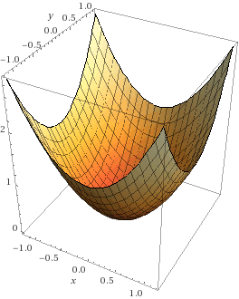
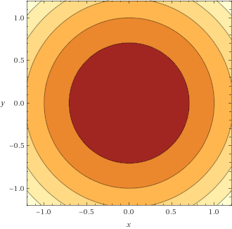
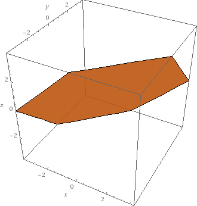

```{r setup, include=FALSE}
knitr::opts_chunk$set(echo = TRUE)
```

# Assignment
Pick any exercise in Chapter 12 of the calculus textbook.  Post the solution or your attempt.  Discuss any issues you might have had.

What were the most valuable elements you took away from this course?  

## Section 12.1, p. 689, ex. 27-30
In Exercises 27 – 30, describe the level surfaces of the given
functions of three variables.

### 27. $f(x,y,z) = x^2+y^2+z^2$ **Sphere**


### 28. $f(x,y,z) = z - x^2 + y^2$ **Hyperbolic paraboloid**


### 29. $f(x,y,z) = \frac{x^2 + y^2}{z}$ **Infinite paraboloid**



#### As a contour plot:


#### Who knew?


### 30. $f(x,y,z)= \frac{z}{x-y}$ **Plane**


## Most valuable elements
- Self-awareness.
- Purpose.
- Practice problems.
- Mastery.

### Self-awareness
I always believed I had great focus. I'm a professional classical pianist. I have a masters in music. I've performed all over the world. I take focus for granted. I think nothing of sitting down to practice for four hours straight, no break. Six hours and up is no sweat (but then my wife begins to forget what I look like). Unbroken effort like that isn't even work. I like it.

I was intimidated in this math course. I realized, even when I sat in front of my computer, I was procrastinating, so I started the Pomodoro Technique (it just means putting a timer on for scheduling your breaks). I was mortified to discover my focus was all over the road! My fear of the material provoked my concentration to wander all over the place. That was brutul to face, but I fixed it.

### Practice problems
I realized, too, that my mastery of whatever material I study is insufficient. I get good grades, but I'm less effective than I aspire to be. During the semester, I spoke up about my frustrations and received good guidance. I wasn't doing enough practice problems. I never have. My habit has always been to read and go on. Now I have a stack of practice workbooks for statistics and I work them religiously, day after day. I'll do the same thing to solidify my linear algebra and to review everything I ever learned about calculus (and more).

### Mastery
Mastery begins with the intention to acquire it. I think my intention towards data science must be more conscious and explicit. Every time I crack a book now I consider the question, "How am I going to contact this material again to demonstrate mastery?" Besides the methods I've always employed with Anki, notes, highlights, and whatever, I added one more method, keeping a simple journal. Each day I note what topics I worked on that day. That puts me on notice of what I expect to master. My review over the next few days is a reality check. Have I mastered this?

### Purpose
The whole time I've been working on data science, through online courses before CUNY and now at CUNY, I've wondered what industry I wanted to apply data science to. The answer became clear this semester after a pandemic and contracting and recovering from COVID myself; public health. That is what feels most relevant and urgent to me. Now I know where I'm going.