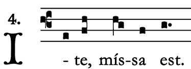

## Problem set 1
Verify using `R` that SVD and Eigenvalues are related as worked
out in the weekly module. Given a 3 × 2 matrix, $A = \begin{bmatrix} 1 & 2 & 3 \\ -1 & 0 & 4\end{bmatrix}$

```{r}
A <- matrix(c(
	1, 2, 3,
	-1, 0, 4
), nrow = 2, byrow = T)
```

- Write code in `R` to compute $X = AA^T$ and $Y = A^TA$.
```{r}
X <- A %*% t(A)
Y <- t(A) %*% A
X
Y
```
- Compute the eigenvalues and eigenvectors of $X$ and $Y$ using the built-in commands in `R`.
```{r}
eigen.X <- eigen(X)
eigen.Y <- eigen(Y)

# Eigenvalues and eigenvectors of X.
eigen.X
# Eigenvalues and eigenvectors of Y.
eigen.Y
```
- Compute the left-singular, singular values, and right-singular vectors of $A$ using the `svd` command.
```{r}
svd.A <- svd(A)
svd.A
```

- Examine the two sets of singular vectors and show that they are indeed eigenvectors of $X$ and $Y$. In addition, the two non-zero eigenvalues (the 3rd value will be very close to zero, if not zero) of both $X$ and $Y$ are the same and are squares of the non-zero singular values of $A$.
```{r}
# COMPARE X
# Eigenvectors of X.
eigen.X$vectors
# Compare to left singular vectors of A. Some of the signs are flipped.
# I'll examine that later.
svd.A$u

# COMPARE Y
# Eigenvectors of Y.
eigen.Y$vectors
# Compare to right singular vectors of A. Some of the signs are flipped.
# I'll examine that later.
svd.A$v

# Compare the eigenvalues of X and Y.
# Formats of exponential notation differ, but the non-zero values are identical.
eigen.X$values
eigen.Y$values

# Compare the squares of the SVD's singular values.
# Expected results: equal to the eigenvalues of X and Y.
svd.A$d^2
```

### Sign differences
I noted differences in sign among elements of eigenvectors computed by the `R` functions, `eigen()` and `svd()`. These appear to be a matter of scaling and I expect the eigenvectors to be valid.

I'm restating what we know about eigenvalues using unconventional labels so we don't confuse them with other terms in this paper. We expect for a matrix $W$, its eigenvalue $\lambda$, and its eigenvector $g$,

$Wg = \lambda g$

```{r}
# Review one of the sign flips.
# X: eigenvector computed by eigen().
eigen.X$vectors[,1]
# A: left singular vector computed by svd().
svd.A$u[,1]
# Yes, there are differences in sign.

# Compare these two products, which should be equal, and they are.
X %*% eigen.X$vectors[,1]
eigen.X$values[1] %*% eigen.X$vectors[,1]

# Compare these two products. Although signs in the eigenvector differ
# from the eigenvector computed by eigen(), these products should be equal
# to each other, and they are.
X %*% svd.A$u[,1]
svd.A$d[1]^2 %*% svd.A$u[,1]
```

**Conclusion: We're okay**


## Problem set 2
Using the procedure outlined in section 1 of the weekly handout, write a function to compute the inverse of a well-conditioned full-rank square matrix using cofactors. Your function should have the following signature:

`B = myinverse(A)`

where $A$ is a matrix, $B$ is its inverse, and $A \times B = I$.

*Note to self*: In order for a matrix to have an inverse, its determinant must be non-zero. I need to go back and see the reasoning for that.

### Design
$A^{-1} = \frac{C^T}{det(A)}$

I can compute the determinant of $A$ with a base `R` function. What I'm left to do is build a matrix of cofactors and take its transpose.

Okay, how do I compute a cofactor? It's the determinant of the sub-matrix $M_{ij}$ together with the appropriate sign $(-1)^{i+j}$

```{r}
myinverse <- function(A){
	# Assumptions:
	#   A is a square matrix.
	#   A has a dimension of at least 3.
	#   A is full rank.
	
	# Allocate a matrix for the cofactors.
	C <- matrix(rep(NA, length(A)), nrow = nrow(A))
	
	# Compute the cofactor matrix.
	for (i in 1:dim(A)[1]) {
		for (j in 1:dim(A)[2]) {
			C[i, j] <- (-1)^(i + j) * det(A[-i, -j])
		}
	}
	
	result <- t(C) / det(A)
	return(result)
}
```

My one-line solution for computing a cofactor, using `R`'s "omitted dimension" references for a matrix is so nifty, I'm just going to pretend for a moment that I must be the only one who thought of it. I'll bask for ten minutes or so before returning to reality. In the mean time, let's test this with some example matrices.

```{r}
library(pracma)

test.myinverse <- function(A) {
	# No coded conditions for this. Just use eyeballs.
	
	print("MATRIX UNDER TEST")
	print(A)
	
	print("DETERMINANT MUST BE NON-ZERO")
	print(det(A))
	
	print("MUST BE FULL RANK")
	print(rref(A))
	
	print("INVERSE")
	print(myinverse(A))
	
	print("MATRIX TIMES ITS TRANSPOSE MUST EQUAL IDENTITY MATRIX")
	print(A %*% myinverse(A))
}

# TEST DATA.
testdata.1 <- matrix(c(
	1, 0, 1,
	1, 1, 0,
	0, 1, 1
), nrow = 3, byrow = T)

testdata.2 <- matrix(c(
	7, 2, 1,
	0, 3, -1,
	-3, 4, -2
), nrow = 3, byrow = T)

testdata.3 <- matrix(c(
	0, -3, -2,
	1, -4, -2,
	-3, 4, 1
), nrow = 3, byrow = T)

testdata.4 <- matrix(c(
	5, 6, 6, 8,
	2, 2, 2, 8,
	6, 6, 2, 8,
	2, 3, 6, 7
), nrow = 4, byrow = T)

# Singular matrix
testdata.5 <- matrix(c(
	1, 1, 1,
	2, 3, 1,
	0, -1, 1
), nrow = 3, byrow = T)

# EXECUTE TEST CYCLE.
test.myinverse(testdata.1)

# Correct results, if you allow for precision.
test.myinverse(testdata.2)

# Precision again.
test.myinverse(testdata.3)

# Test a 4x4 matrix.
test.myinverse(testdata.4)

# Let's break things. Good ol' negative testing. Since the
# code assumes good input, there is no error handling.
# This is a singular matrix. I just want to see what happens.
test.myinverse(testdata.5)
# Well, that was pretty in a Schadenfreude kind of way.
```


