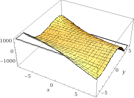
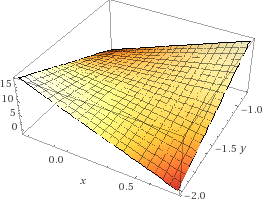
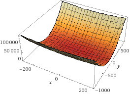
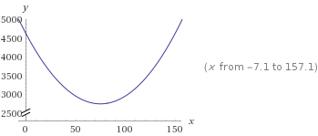

```{r setup, include=FALSE}
knitr::opts_chunk$set(echo = TRUE)
#options(scipen = 999)
```

## Problem 1
Find the equation of the regression line for the given points. Round any final values to the nearest hundredth, if necessary. (5.6,8.8), (6.3,12.4), (7,14.8), (7.7,18.2), (8.4,20.8)

```{r}
x <- c(5.6, 6.3, 7, 7.7, 8.4)
y <- c(8.8, 12.4, 14.8, 18.2, 20.8)
df <- data.frame(cbind(x, y))

df_m <- lm(y ~ x, data = df)
plot(y ~ x, data = df)
abline(df_m)

df_m
```

### Answer
$$y = 4.26x - 14.80$$

## Problem 2.
*p. 751*

Find all local maxima, local minima, and saddle points for the function given below. Write your answer(s) in the form $( x, y, z )$. Separate multiple points with a comma.
$$f(x,y) = 24x - 6xy^2 - 8y^3$$

### Partial derivatives of $f$
$$f_x = 24 - 6y^2 \textrm{ and } f_y = -12xy - 24x^2$$
$$f_{xx} = 0 \textrm{ and } f_{yy} = -12x - 48y$$
$$f_{xy} = -12y \textrm{ and } f_{yx} = -12y$$

### Find critical points
Seek critical points where $f_x$ and $f_y$ are simultaneously 0.
$$f_x = 0 \implies 0 = 24 - 6y^2$$
$$\implies 6y^2 = 24$$
$$\implies y^2 = \frac{24}{6} = 4$$
$$\implies y = \pm \sqrt{4} = \pm 2$$
Therefore, our critical points have two possible values for $y$. $f_x = 0$ at $y = \pm 2$.

We're looking for $x$ values for the critical points. In $f_y$, solve for $x$ for each $y$ we found.

Assume $y = 2$
$$f_y = 0 \land y = 2 \implies 0 = -12x \cdot 2 - 24 \cdot 4 = -24x - 96$$
$$\implies 96 = -24x$$
$$\implies x = -4$$

Therefore, $CriticalPoint_1 = (-4, 2)$

Assume $y = -2$
$$f_y = 0 \land y = -2 \implies 0 = -12x \cdot -2 - 24 \cdot 4 = 24x - 96$$
$$\implies 96 = 24x$$
$$\implies x = 4$$

Therefore, $CriticalPoint_2 = (4, 2)$

### Second derivative test
Calculate the test value $D$ for each critical point. Refer to the partial derivatives from above. Evaluate the condition of the second derivative test. 

$$D = f_{xx} f_{yy} - f_{xy}^2$$
For $CriticalPoint_1 = (-4, 2)$
$$D = 0 \cdot (-12x - 48y) - (-12y)^2 = -144y^2$$
$$= -144\cdot 2^2 = -576$$

$D = -576 < 0$. Therefore (-4, 2) is a saddle point.

Consider $CriticalPoint_2$
$$D = -144y^2$$
$$= -144\cdot (-2)^2 = -576$$

$D = -576 < 0$. Therefore (4, -2) is a saddle point.

### Answer


Critical points:

- (-4, 2) is a saddle point.
- (4, -2) is a saddle point.

## Problem 3
A grocery store sells two brands of a product, the "house" brand and a "name" brand. The manager estimates that if she sells the "house" brand for $x$ dollars and the "name" brand for $y$ dollars, she will be able to sell $81 - 21x + 17y$ units of the "house" brand and $40 + 11x - 23y$ units of the "name" brand.

- Step 1. Find the revenue function $R(x,y)$.
- Step 2. What is the revenue if she sells the "house" brand for \$2.30 and the "name" brand for \$4.10?

### Step 1
The revenue is,
$$R = Price_{house} \times Units_{house} + Price_{name} \times Units_{name}$$

$Price_{house} = x$

$Units_{house} = 81 - 21x + 17y$

$Price_{name} = y$

$Units_{name} = 40 + 11x - 23y$

Therefore,
$$R(x, y) = x \cdot (81 - 21x + 17y) + y \cdot (40 + 11x - 23y)$$
$$= x \cdot (81 - 21x + 17y) + y \cdot (40 + 11x - 23y)$$
$$= x81 - 21x^2 + 17xy + 40y + 11xy - 23y^2$$

Therefore, after collecting terms and rearranging,
$$R(x, y) = -21x^2 - 23y^2 + 81x + 40y + 28xy$$

### Step 2
```{r}
x <- 2.30
y <- 4.10

revenue <- -21*x^2 - 23*y^2 + 81*x + 40*y + 28*x*y
```

### Answer


- Step 1: $R(x, y) = -21x^2 - 23y^2 + 81x + 40y + 28xy$
- Step 2: \$`r revenue`

## Problem 4
A company has a plant in Los Angeles and a plant in Denver. The firm is committed to produce a total of 96 units of a product each week. The total weekly cost is given by $C(x,y) = \frac{1}{6}x^2 + \frac{1}{6}y^2 +7x+25y+700$, where $x$ is the number of units produced in Los Angeles and $y$ is the number of units produced in Denver. How many units should be produced in each plant to minimize the total weekly cost?

### Production formula
The conditions of the problem constrain this optimization, such that $x + y = 96$. Therefore, $y = -x + 96$. We substitute this constraint into the cost function.
$$\frac{1}{6}x^2 + \frac{1}{6}(-x + 96)^2 + 7x + 25(-x + 96) + 700$$
$$= \frac{1}{6}x^2 + \frac{1}{6}(x^2 - 192x + 9216) + 7x - 25x + 2400 + 700$$
Collecting terms,
$$= \frac{1}{3}x^2 - 32x + 1536 - 18x + 3100$$
$$= \frac{1}{3}x^2 - 50 x + 4636$$

### Extreme value
Find the first and second derivatives.
$$C' = \frac{2}{3}x - 50$$
$$C'' = \frac{2}{3}$$
Set the first derivative to 0 to find an extreme value.
$$0 = \frac{2}{3}x - 50 \implies 50 = \frac{2}{3}x \implies x = \frac{3}{2} \cdot 50 = 75$$
An extreme value is located at (75, 96 - 75), which is (75, 21).

Since $C''$ is positive, the function is concave up at this extreme value, which is therefore a local minimum and indeed an absolute minimum.

### Plots
**The cost function $C(x, y)$**



**Production function**

Since $y = -x + 96$, this subset is a diagonal slice across that trough.



The plot illustrates the minimum found for $x$, 75.

### Answer
The production units which minimize weekly costs are:

- Los Angeles: 75.
- Denver: 21.

## Problem 5
Evaluate the double integral on the given region.
$$\iint\limits_{R}(e^{8x+3y}) dA; R: 2 \le x \le 4 \textrm{ and } 2 \le y \le 4$$
Write your answer in exact form without decimals.

### Generalize integration
Several times, we're going to need to integrate the function $f(x) = e^{nx}$. Generalize that operation using $u$-substition.
$$\int e^{nx} dx$$
Let $u = nx,\ dx = ndx$
$$\int e^{nx} dx = \frac{1}{n}\int e^{nx} ndx = \frac{1}{n}\int e^u du$$
$$= \frac{1}{n} e^u + C = \frac{1}{n}e^{nx} + C$$

We will use this result in upcoming steps.

### Express definite integral
$$\int\limits_2^4 \int\limits_2^4 e^{8x + 3y} dy dx$$
$$= \int\limits_2^4 (\int\limits_2^4 e^{8x} e^{3y} dy) dx$$

We're evaluating the inner integral now. With respect to $y$, $x$ is a constant. Therefore,
$$= \int\limits_2^4 (e^{8x} \int\limits_2^4 e^{3y} dy) dx$$
$$= \int\limits_2^4 (e^{8x} \cdot \frac{1}{3} e^{3y} \bigg\rvert_{2}^4) dx$$
$$= \int\limits_2^4 \frac{e^{8x}}{3} (e^{12} - e^6) dx$$
Move the constants to the outside of the integral.
$$=  \frac{(e^{12} - e^6)}{3}\int\limits_2^4 e^{8x} dx$$

$$=  \frac{(e^{12} - e^6)}{3} \cdot \frac{1}{8} e^{8x} \bigg\rvert_2^4$$
$$=  \frac{1}{24}(e^{12} - e^6) (e^{32} - e^{16})$$

### Answer
$$=  \frac{1}{24}(e^{32} - e^{16})(e^{12} - e^6)$$

## Reference
All plots: [WolframAlpha](https://www.wolframalpha.com).