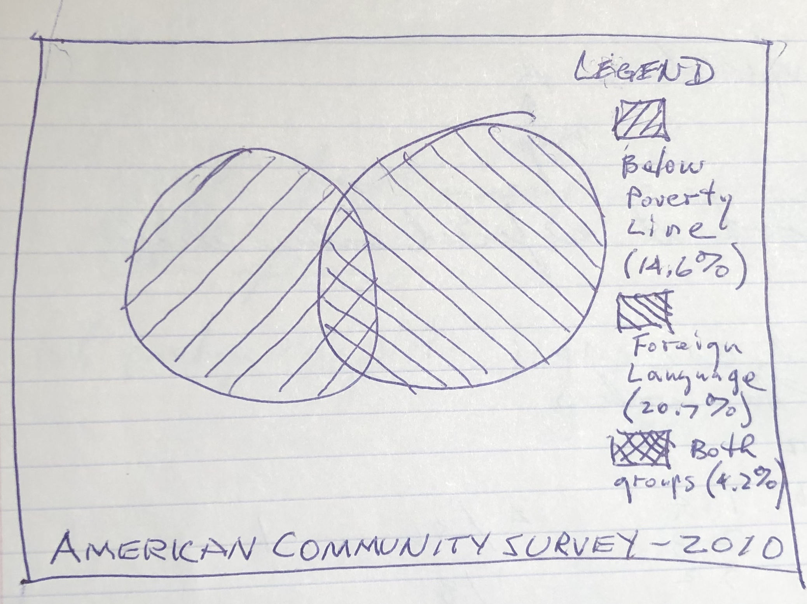
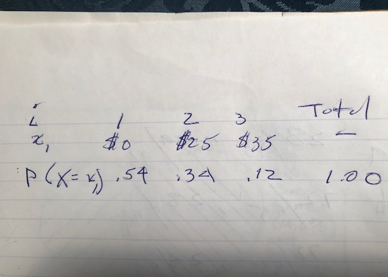
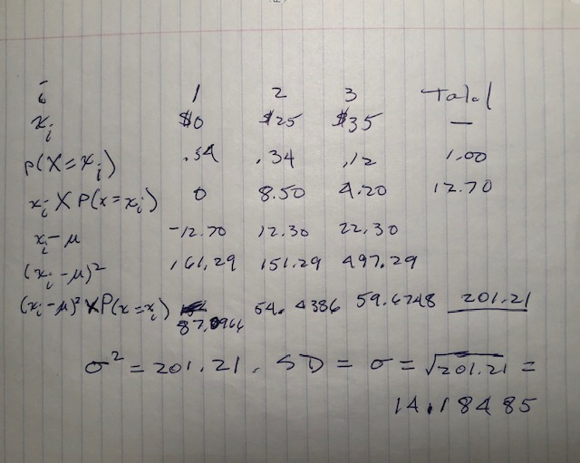

**Dice rolls.** (3.6, p. 92) If you roll a pair of fair dice, what is the probability of

(a) getting a sum of 1? **Answer**: 0.
(b) getting a sum of 5? **Answer**: 1/8 = 0.125. There are four combinations out of 36 that add up to 5: 1-4, 2-3, 3-2, 4-1.
(c) getting a sum of 12? **Answer**: 1/36 = 0.0277778. Only one combination adds up to 12. Both dice have to come up 6.

--------------------------------------------------------------------------------

\clearpage

**Poverty and language**. (3.8, p. 93) The American Community Survey is an ongoing survey that provides data every year to give communities the current information they need to plan investments and services. The 2010 American Community Survey estimates that 14.6% of Americans live below the poverty line, 20.7% speak a language other than English (foreign language) at home, and 4.2% fall into both categories.

(a) Are living below the poverty line and speaking a foreign language at home disjoint? **Answer**: No.
(b) Draw a Venn diagram summarizing the variables and their associated probabilities.

(c) What percent of Americans live below the poverty line and only speak English at home?

**Answer**: 14 - 4.2 = 9.8%.

(d) What percent of Americans live below the poverty line or speak a foreign language at home?

**Answer**: 14.6 + 20.7 - 4.2 = 31.1%. Subtract the intersection in order not to double count it. 

(e) What percent of Americans live above the poverty line and only speak English at home?

**Answer**: (100 - 14.6) - (20.7 - 4.2) = 68.9%. The reversing of signs effectively adds back in the intersection that must not be removed in this estimate.

(f) Is the event that someone lives below the poverty line independent of the event that the person speaks a foreign language at home?

**Answer**: Yes.

--------------------------------------------------------------------------------

\clearpage

**Assortative mating**. (3.18, p. 111) Assortative mating is a nonrandom mating pattern where individuals with similar genotypes and/or phenotypes mate with one another more frequently than what would be expected under a random mating pattern. Researchers studying this topic collected data on eye colors of 204 Scandinavian men and their female partners. The table below summarizes the results. For simplicity, we only include heterosexual relationships in this exercise.

\begin{center}
\begin{tabular}{ll  ccc c}
                                        &           & \multicolumn{3}{c}{\textit{Partner (female)}} \\
\cline{3-5}
                                        &           & Blue  & Brown     & Green     & Total \\
\cline{2-6}
                                        & Blue      & 78    & 23        & 13        & 114 \\
\multirow{2}{*}{\textit{Self (male)}}   & Brown     & 19    & 23        & 12        & 54 \\
                                        & Green     & 11    & 9         & 16        & 36 \\
\cline{2-6}
                                        & Total     & 108   & 55        & 41        & 204
\end{tabular}
\end{center}

(a) What is the probability that a randomly chosen male respondent or his partner has blue eyes?

**Answer**: (114 + 108) / (2 * 204) = 0.5441176. (Expressed as a ratio.) You could easily answer too quickly on this one. I hope I"m still not too quick! If you take this table for granted, you can total up the men and women and divide by 204, but that is incorrect. 204 is the number of *couples*. There are 2 * 204 people, and the question asked for the probability of choosing a male *or* a female. That means you have to add them.

(b) What is the probability that a randomly chosen male respondent with blue eyes has a partner with blue eyes?

**Answer**: 78 / 204 = 0.3823529. This is a question about couples, so you can read the numbers right off the table.

(c) What is the probability that a randomly chosen male respondent with brown eyes has a partner with blue eyes?

**Answer**: 19 / 204 = 0.0931373.

What about the probability of a randomly chosen male respondent with green eyes having a partner with blue eyes?

**Answer**: 11 / 204 = 0.0539216.

(d) Does it appear that the eye colors of male respondents and their partners are independent? Explain your reasoning.

**Answer**: No, they appear dependent. For each sex and eye color, the combination of commonality is the most frequent occurrence with only one exception, in which case a female with brown eyes is equally likely to have a male with brown eyes or blue eyes (23 / 204 = 0.1127451). Otherwise, for example, 78 blue-eyed males have a blue-eyed female partner, while only 23 have a brown-eyed partner and 13 have a green-eyed partner. 

--------------------------------------------------------------------------------

\clearpage

**Books on a bookshelf**. (3.26, p. 114) The table below shows the distribution of books on a bookcase
based on whether they are nonfiction or fiction and hardcover or paperback.

\begin{center}
\begin{tabular}{ll  cc c}
                                &           & \multicolumn{2}{c}{\textit{Format}} \\
\cline{3-4}
                                &           & Hardcover     & Paperback     & Total \\
\cline{2-5}
\multirow{2}{*}{\textit{Type}}  & Fiction   & 13            & 59            & 72 \\
                                & Nonfiction& 15            & 8             & 23 \\
\cline{2-5}
                                & Total     & 28            & 67            & 95 \\
\cline{2-5}
\end{tabular}
\end{center}

(a) Find the probability of drawing a hardcover book first then a paperback fiction book second when drawing without replacement.

**Answer**: (28 / 95) * (59 / 94) = 0.1849944.

(b) Determine the probability of drawing a fiction book first and then a hardcover book second, when drawing without replacement.

**Answer**: (72 /95 ) * (28 / 94) = 0.2257559.

(c) Calculate the probability of the scenario in part (b), except this time complete the calculations under the scenario where the first book is placed back on the bookcase before randomly drawing the second book.

**Answer**: (72 /95 ) * (28 / 95) = 0.2233795.

(d) The final answers to parts (b) and (c) are very similar. Explain why this is the case.

**Answer**: We sampled a very small fraction of the population. When the sample is under 10%, observations are nearly independent even when sampling without replacement.

--------------------------------------------------------------------------------

\clearpage

**Baggage fees**. (3.34, p. 124) An airline charges the following baggage fees: $25 for the first bag and $35 for the second. Suppose 54% of passengers have no checked luggage, 34% have one piece of checked luggage and 12% have two pieces. We suppose a negligible portion of people check more than two bags.

(a) Build a probability model, compute the average revenue per passenger, and compute the corresponding standard deviation.

**Answer**

Average revenue per passenger: (.54 * 0) + (.34 * 25) + (.12 * 35) = Expected value of X = E(X) = $12.70.

(b) About how much revenue should the airline expect for a flight of 120 passengers? 

**Answer**: 120 * 12.70 = $1524.

With what standard deviation? Note any assumptions you make and if you think they are justified.

**Answer**
Standard deviation = 14.18. This assumes a fully occupied flight. My anecdotal evidence suggests this a reasonable assumption, given the overbooking I witness on well-traveled routes.

--------------------------------------------------------------------------------

\clearpage

**Income and gender**. (3.38, p. 128) The relative frequency table below displays the distribution of annual total personal income (in 2009 inflation-adjusted dollars) for a representative sample of 96,420,486 Americans. These data come from the American Community Survey for 2005-2009. This sample is comprised of 59% males and 41% females.

\begin{center}
\begin{tabular}{lr}
  \hline
\textit{Income}         & \textit{Total} \\
  \hline
\$1 to \$9,999 or loss  & 2.2\% \\
\$10,000 to \$14,999    & 4.7\% \\
\$15,000 to \$24,999    & 15.8\% \\
\$25,000 to \$34,999    & 18.3\% \\
\$35,000 to \$49,999    & 21.2\% \\
\$50,000 to \$64,999    & 13.9\% \\
\$65,000 to \$74,999    & 5.8\% \\
\$75,000 to \$99,999    & 8.4\% \\
\$100,000 or more       & 9.7\% \\
   \hline
\end{tabular}
\end{center}

(a) Describe the distribution of total personal income. **Answer**: This is a symmetric, unimodal distribution with a center in the range of $35K - $49K.
(b) What is the probability that a randomly chosen US
resident makes less than $50,000 per year? **Answer**: Summing the probabilites less than $50K gives 0.82.
(c) What is the probability that a randomly chosen US resident makes less than $50,000 per year and is female?
Note any assumptions you make. **Answer**: The probability from (b) multiplied by the ratio of women, .41, which equals 0.4018. This assumes that the ratio of men to women is consistent in every income range.
(d) The same data source indicates that 71.8% of females
make less than $50,000 per year. Use this value to determine whether or not the assumption you made in part (c) is valid. **Answer**: That specifically violates my assumption and indicates that my estimate is undervalued. My estimate for women making under $50,000 per year should be higher.

