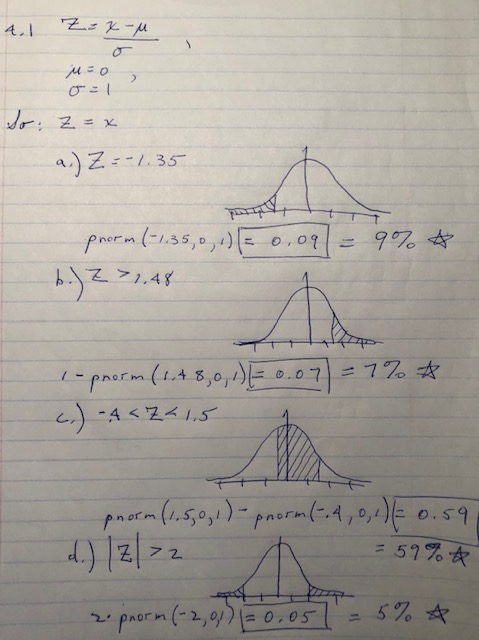

**Area under the curve, Part I**. (4.1, p. 142) What percent of a standard normal distribution $N(\mu=0, \sigma=1)$ is found in each region? Be sure to draw a graph.

(a) $Z < -1.35$
(b) $Z > 1.48$
(c) $-0.4 < Z < 1.5$
(d) $|Z| > 2$





--------------------------------------------------------------------------------

\clearpage

**Triathlon times, Part I** (4.4, p. 142) In triathlons, it is common for racers to be placed into age and gender groups. Friends Leo and Mary both completed the Hermosa Beach Triathlon, where Leo competed in the *Men, Ages 30 - 34* group while Mary competed in the *Women, Ages 25 - 29* group. Leo completed the race in 1:22:28 (4948 seconds), while Mary completed the race in 1:31:53 (5513 seconds). Obviously Leo finished faster, but they are curious about how they did within their respective groups. Can you help them? Here is some information on the performance of their groups:

* The finishing times of the \textit{Men, Ages 30 - 34} group has a mean of 4313 seconds with a standard deviation of 583 seconds.
* The finishing times of the \textit{Women, Ages 25 - 29} group has a mean of 5261 seconds with a standard deviation of 807 seconds.
* The distributions of finishing times for both groups are approximately Normal.

Remember: a better performance corresponds to a faster finish.

(a) Write down the short-hand for these two normal distributions.

**ANSWER**

- Men, Ages 30 - 34: $N(\mu=4313, \sigma=583)$
- Women, Ages 25 - 29: $N(\mu=5261, \sigma=807)$

(b) What are the Z-scores for Leo's and Mary's finishing times? What do these Z-scores tell you?


```r
z_leo <- (4948 - 4313) / 583
z_mary <- (5513 - 5261) / 807
```

- Z of Leo: 1.0891938
- Z of Mary: 0.3122677

The Z scores quantify the finishing times relative to the runners' respective groups.

(c) Did Leo or Mary rank better in their respective groups? Explain your reasoning.

**ANSWER**

Leo did better. Z scores standardize position within a distribution for comparison across distributions.

(d) What percent of the triathletes did Leo finish faster than in his group?

**ANSWER**

I don't remember the book saying so, but it seemed to me you could use `pnorm()` to estimate this in two ways. One, pass the runner's time into `pnorm()` with the mean and standard deviation for their group. Two, pass the runner's Z score into `pnorm()` using a mean of 0 and a standard deviation of 1. It worked.


```r
q_leo_meth1 <- pnorm(4948, 4313, 583)
q_leo_meth2 <- pnorm(z_leo)
```

- One: 86.1965789%
- Two: 86.1965789%

(e) What percent of the triathletes did Mary finish faster than in her group?

**ANSWER**


```r
q_mary_meth1 <- pnorm(5513, 5261, 807)
q_mary_meth2 <- pnorm(z_mary)
```

- One: 62.2581441%
- Two: 62.2581441%

(f) If the distributions of finishing times are not nearly normal, would your answers to parts (b) - (e) change? Explain your reasoning.

**ANSWER**

If what is meant is to assume a non-normal distribution at the outset, then by definition these would be the results and therefore, no, the answers in (b), (d), and (e) wouldn't change. They were calculated from what was given. They are calculations from runners' times and the means and standard deviations of their respective groups, whatever the distributions were of those groups.

Given the same times, means, and standard distibutions, the calculated Z scores would be whatever they are. However, changing the assumption from normal distribution to non-normal could affect my conclusion about the comparison between Leo and Mary in answer (c). Calculation of Z score assumes a normal distribution. Here, the Z scores differ widely. I might still conclude Leo did better than Mary, though I would be unable to quantify it accurately. If the Z scores were closer, then I would say the results are inconclusive.

If the distributions of finishing times are not nearly normal, then we shouldn't be using Z score calculations. I would seek ranking data instead. Maybe for a comparison of Leo and Mary it would be sufficiently meaningful to talk about performance in terms of percentile from rank within the group count.

On the other hand, I would also like to look at outliers. If the results were not normal, there could be a story behind it. Were some celebrities in the event, a few Olympic medalists there to garner media coverage, and the rest predominantly not competitive athletes? What happens to the distributions if those particular outliers are removed? Were there handicapped runners included in the categories, or did they have their own categories? I would like to know more about the groups. Perhaps they can be filtered in a meaningful way that gets them to a normal distribution and a meaningful comparison of Leo and Mary.


--------------------------------------------------------------------------------

\clearpage

**Heights of female college students** Below are heights of 25 female college students.

\[ \stackrel{1}{54}, \stackrel{2}{55}, \stackrel{3}{56}, \stackrel{4}{56}, 
\stackrel{5}{57}, \stackrel{6}{58}, \stackrel{7}{58}, \stackrel{8}{59}, 
\stackrel{9}{60}, \stackrel{10}{60}, \stackrel{11}{60}, \stackrel{12}{61}, 
\stackrel{13}{61}, \stackrel{14}{62}, \stackrel{15}{62}, \stackrel{16}{63}, 
\stackrel{17}{63}, \stackrel{18}{63}, \stackrel{19}{64}, \stackrel{20}{65}, 
\stackrel{21}{65}, \stackrel{22}{67}, \stackrel{23}{67}, \stackrel{24}{69}, 
\stackrel{25}{73} \]

(a) The mean height is 61.52 inches with a standard deviation of 4.58 inches. Use this information to determine if the heights approximately follow the 68-95-99.7% Rule.

**ANSWER**


```r
heights_mean <- 61.52
heights_sd <- 4.58

heights_area_1sd <- pnorm((heights_mean + heights_sd), heights_mean, heights_sd) -
	pnorm((heights_mean - heights_sd), heights_mean, heights_sd)

heights_area_2sd <- pnorm(heights_mean + (2 * heights_sd), heights_mean, heights_sd) -
	pnorm(heights_mean - (2 * heights_sd), heights_mean, heights_sd)

heights_area_3sd <- pnorm(heights_mean + (3 * heights_sd), heights_mean, heights_sd) -
	pnorm(heights_mean - (3 * heights_sd), heights_mean, heights_sd)
```

- Area under the curve within 1 standard deviation: 68.2689492%.
- Within 2 standard deviations: 95.4499736%.
- Within 3 standard deviations: 99.7300204%.

*Conclusions*: Yes, the heights approximately follow the 68-95-99 Rule.

(b) Do these data appear to follow a normal distribution? Explain your reasoning using the graphs provided below.


\includegraphics[width=0.5\linewidth]{Homework4_files/figure-latex/unnamed-chunk-2-1} \includegraphics[width=0.5\linewidth]{Homework4_files/figure-latex/unnamed-chunk-2-2} 

**ANSWER**

Yes, they follow a normal distribution. The density histogram aligns decently with a normal probability density curve. (Is that the right term for that red line?) The points on the QQ plot fall predominantly on the line, while indicating a slight right skew evidenced by the extreme points that fall above the normal line. Multiple random normal distributions, plotted below, continue to align with the heights data.


```r
# Use the DATA606::qqnormsim function
qqnormsim(heights)
```

<!-- --> 


--------------------------------------------------------------------------------

\clearpage

**Defective rate.** (4.14, p. 148) A machine that produces a special type of transistor (a component of computers) has a 2% defective rate. The production is considered a random process where each transistor is independent of the others.

**4.14 Work papers. Answers are below, in line with the questions.** 

Thinking about the wording carefully, begin by defining success. The sense of this question defines success as a defect.


```r
# PART A.
# The negative binomial distribution tells you the probability of observing
# the first success on a given trial. 
n <- 10
k <- 1
p <- 0.02

# I want to see the equivalence of computing factorials and using the choose()
# function.
(factorial(n) / (factorial(k) * factorial(n - k)))
```

```
## [1] 10
```

```r
choose(n, k)
```

```
## [1] 10
```

```r
# The binomial function would tell me the probability of one defect in 10 trials,
# but there are 10 positions where that could occur. I don't want that. I want only
# the 10th trial to be the successful one. I think I need to use the negative
# binomial distribution.

# This is how the binomial would look
choose(n, k) * p^k * (1 - p)^(n - k)
```

```
## [1] 0.1667496
```

```r
# dbinom(). I have to remember that it reverses the expression of "n choose k".
dbinom(k, n, p)
```

```
## [1] 0.1667496
```

```r
# This is the negative binomial, which is my answer. It's one tenth of the
# previous probability. I think I reasoned it out and it makes sense, since I
# only want one of the 10 cases in which one success appears in 10 trials,
# namely the last one.
choose((n-1), (k-1)) * p^k * (1 - p)^(n - k)
```

```
## [1] 0.01667496
```

```r
ans_4_14a <- choose((n-1), (k-1)) * p^k * (1 - p)^(n - k)

# dnbinomial(). Does NOT reverse "n choose k". I don't really understand the meanings
# of the parameters for dbinom() and dnbinom(). I'm mindlessly plugging in arguments
# to get the answers I want.
dnbinom(10, 1, p)
```

```
## [1] 0.01634146
```

```r
# PART B.
# Apply the multiplicaton rule to the probability of failure.
ans_4_14b <- (1 - p)^100

# PART C.
# The geometric distribution applies. Probability of first success.
ans_4_14c1 <- 1 / p
ans_4_14c2 <- sqrt((1 - p) / p^2)

# PART D.
p <- 0.05
ans_4_14d1 <- 1 / p
ans_4_14d2 <- sqrt((1 - p) / p^2)
```


(a) What is the probability that the 10th transistor produced is the first with a defect? **0.016675**
(b) What is the probability that the machine produces no defective transistors in a batch of 100? **0.1326196**
(c) On average, how many transistors would you expect to be produced before the first with a defect? **The first defect, on average, would appear on transister number 50. The way this question is worded, the answer is 49 transistors would, on average, be produced without a defect, with a defect appearing on number 50.** What is the standard deviation? **49.4974747.**
(d) Another machine that also produces transistors has a 5% defective rate where each transistor
is produced independent of the others. On average how many transistors would you expect to be produced with this machine before the first with a defect? **19 without a defect until the first one, appearing on average with number 20.** What is the standard deviation? **19.4935887.**
(e) Based on your answers to parts (c) and (d), how does increasing the probability of an event affect the mean and standard deviation of the wait time until success? **It reduces the mean and the standard deviation of the wait time until success.**


--------------------------------------------------------------------------------

\clearpage

**Male children.** While it is often assumed that the probabilities of having a boy or a girl are the same, the actual probability of having a boy is slightly higher at 0.51. Suppose a couple plans to have 3 kids.

(a) Use the binomial model to calculate the probability that two of them will be boys.


```r
dbinom(2, 3, 0.51)
```

```
## [1] 0.382347
```

(b) Write out all possible orderings of 3 children, 2 of whom are boys. Use these scenarios to calculate the same probability from part (a) but using the addition rule for disjoint outcomes. Confirm that your answers from parts (a) and (b) match.

B B G

B G B

G B B


```r
0.51^2 * 0.49 + 0.51^2 * 0.49 + 0.51^2 * 0.49
```

```
## [1] 0.382347
```
(c) If we wanted to calculate the probability that a couple who plans to have 8 kids will have 3 boys, briefly describe why the approach from part (b) would be more tedious than the approach from part (a). **There are 56 permutations of choosing 3 boys from 8 kids, so the addition formula would be 19 times as long.**


--------------------------------------------------------------------------------

\clearpage

**Serving in volleyball.** (4.30, p. 162) A not-so-skilled volleyball player has a 15% chance of making the serve, which involves hitting the ball so it passes over the net on a trajectory such that it will land in the opposing team’s court. Suppose that her serves are independent of each other.

(a) What is the probability that on the 10th try she will make her 3rd successful serve?


```r
dnbinom(10, 3, 0.15)
```

```
## [1] 0.04385377
```

(b) Suppose she has made two successful serves in nine attempts. What is the probability that her 10th serve will be successful?


```r
p_success <- 0.15
p_event1 <- dbinom(2, 9, 0.15)
p_event2 <- 0.15
p_event1 * p_event2
```

```
## [1] 0.03895012
```

(c) Even though parts (a) and (b) discuss the same scenario, the probabilities you calculated should be different. Can you explain the reason for this discrepancy? **The scenarios aren't really the same. The first scenario is one event of 10 trials, the second is two events, one of nine trials and one of one trial. In the first scenario, there is a chance she won't have two successes in the first nine attempts. In the second scenario, it is given that she has had two sucesses in the first event of nine trials.**


